# BT_Assignment3_Pet_dApp

## Blockchain Technologies - Assignment #3 Student: Bakgeldi Alkhabay | Group: CS-2008

# App creation process

## Solidity IDE(REMIX)

### Creation of Smart Contract
 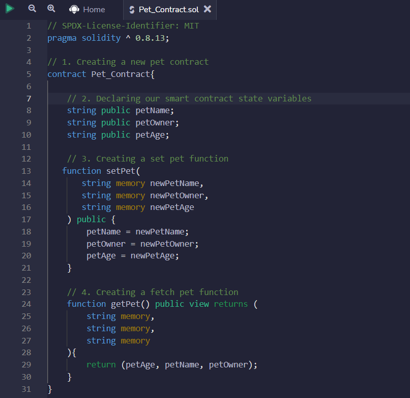

### Compiling the Smart Contract
 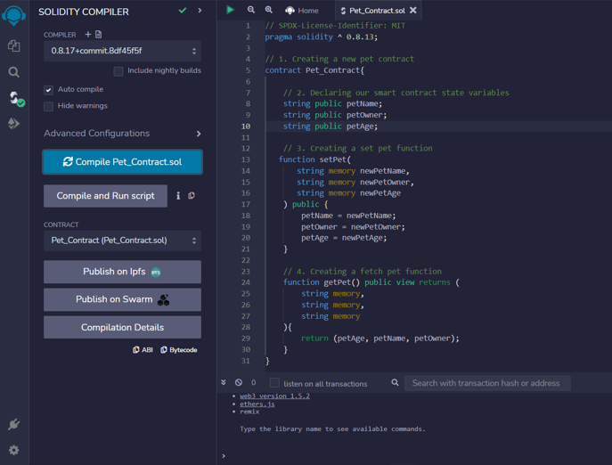

### Getting Goerli Testnet Token
 

### Deploying the Smart Contract
 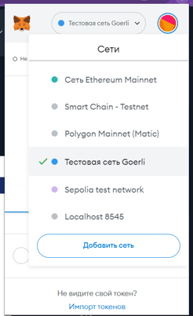
 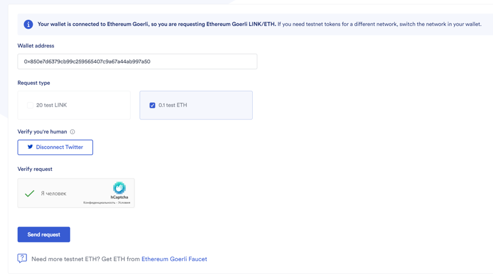
 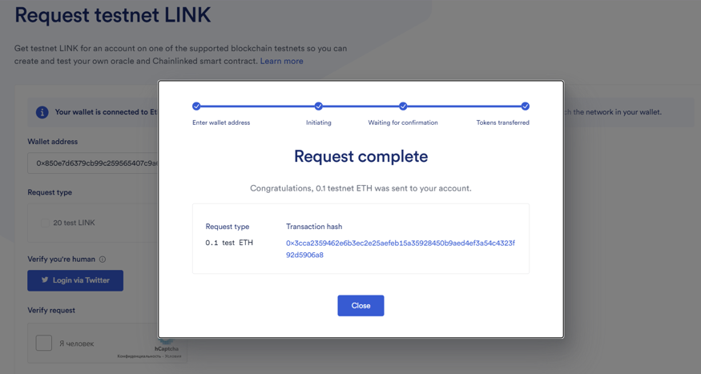
 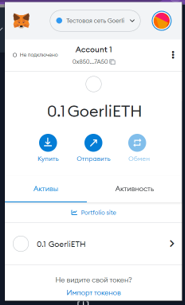

### Testing the Smart Contract
 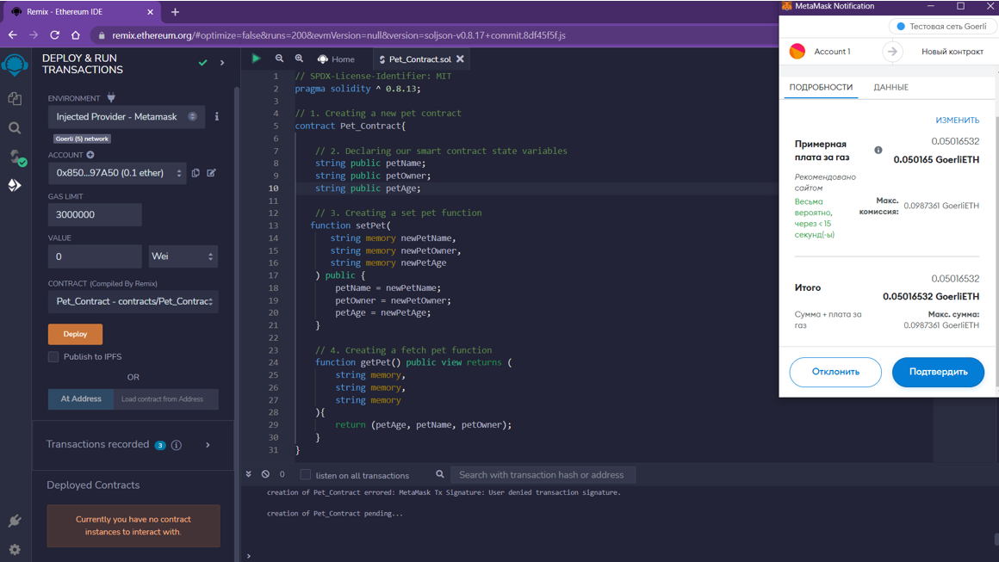
 
 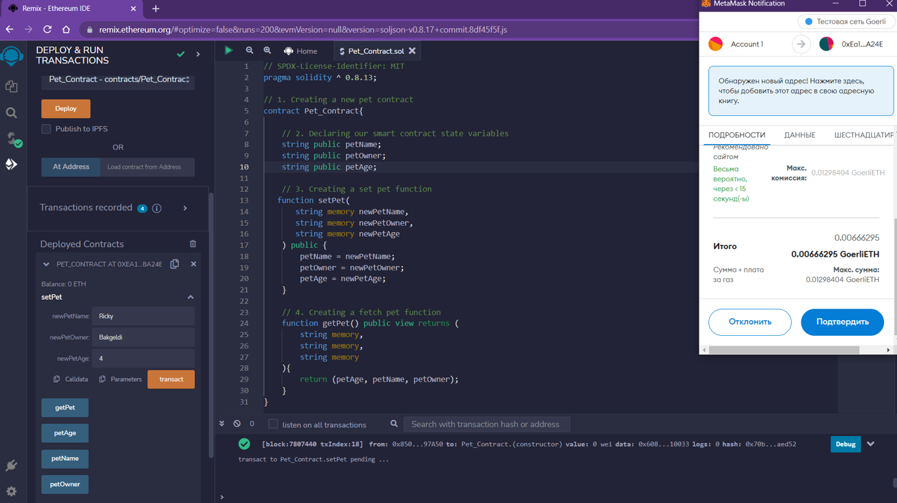
 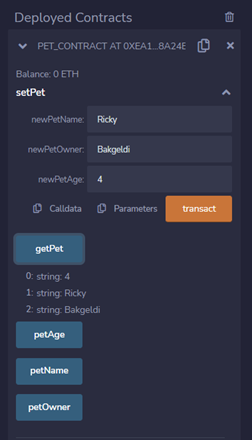
 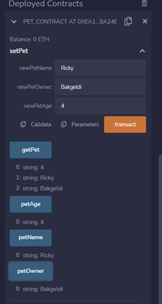

## Building the Front End

### Installing Ethers.js
 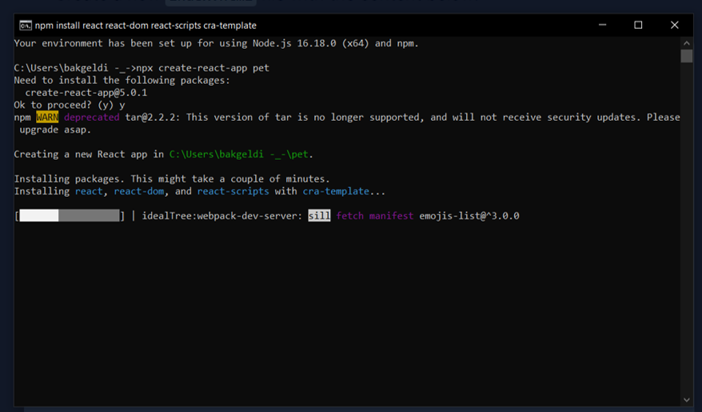
 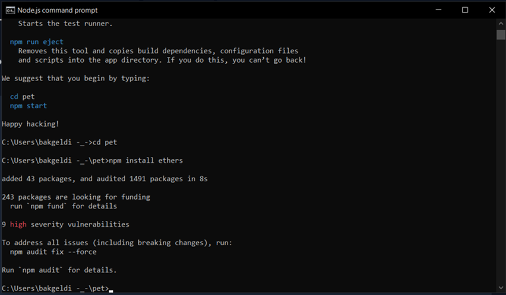
 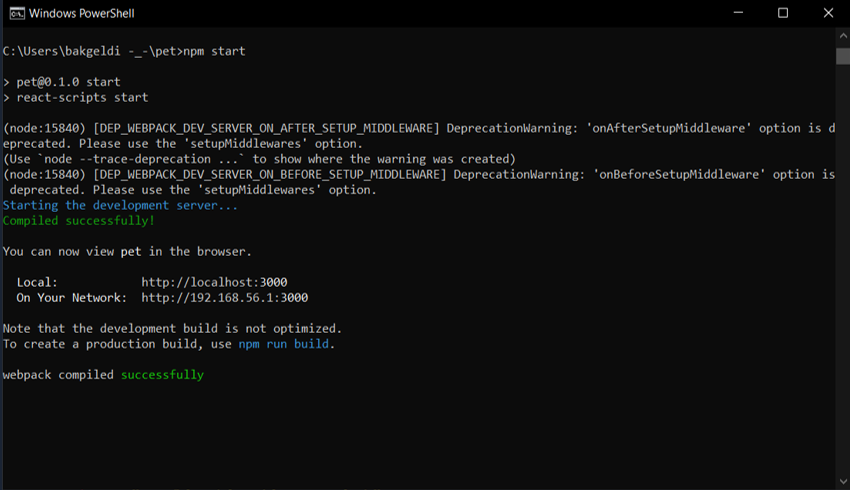

### Building the Pet Form
 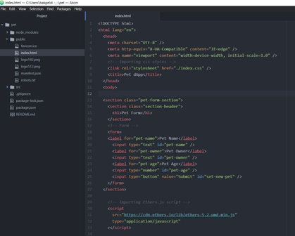
 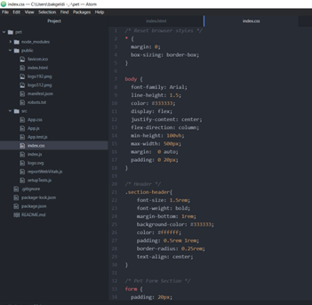

### Building the Pet Details Section

### Creating the Signer Logic

### Creating the SetNewPet Function

### Creating the getCurrentPet Function

# Testing Our dApp

