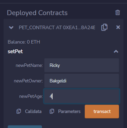
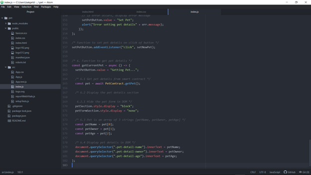

# BT_Assignment3_Pet_dApp

## Blockchain Technologies - Assignment #3 Student: Bakgeldi Alkhabay | Group: CS-2008
## Source: https://web3.hashnode.com/solidity-tutorial-creating-an-ethereum-dapp-with-ethersjs#heading-step-2-building-the-pet-form

## Demo
Here is my demo of the app.

# App creation process

## Solidity IDE(REMIX)

### Creation of Smart Contract
Сreate a new file called Pet_Contract.sol in the contracts folder, and paste the code from source.
 

### Compiling the Smart Contract
Navigate to the "Solidity Compiler" section. Select the compiler version that matches the one specified in our smart contract. Then click on the "Compile" button.
 

### Getting Goerli Testnet Token
Navigate to <a href='faucets.chain.link'>Faucets</a>. Connect with your Metamask wallet. Ensure to switch to the Goerli Test network on your Metamask. Solve the captcha, and click on the "Send 0.1 test ETH" button. Check your Metamask for the new balance.
 
 
 
 

### Deploying the Smart Contract
Navigate to the "Deploy and Run Transactions" section. Select "Injected Web3" as the environment. Click on the "Deploy" button to deploy our smart contract on the Goerli Testnet. We'll be prompted to confirm the contract deployment gas fee. We see our smart contract name under the "Deployed Contracts" section, as shown below:
 
 
 

### Testing the Smart Contract
Click on the dropdown arrow in the setPet function to expand the input boxes. Fill the input boxes with your pet's details and click on the "Transact" button. Confirm the transaction gas fee. Check each funtion by clicking on the buttons.
 
 

## Building the Front End

### Installing Ethers.js
 
 
 

### Building the Pet Form
 
 

### Building the Pet Details Section
 
 

### Creating the Signer Logic
 
 
 
 
 

### Creating the SetNewPet Function
 

### Creating the getCurrentPet Function
 
 

# Testing the dApp
 
 
 
 
